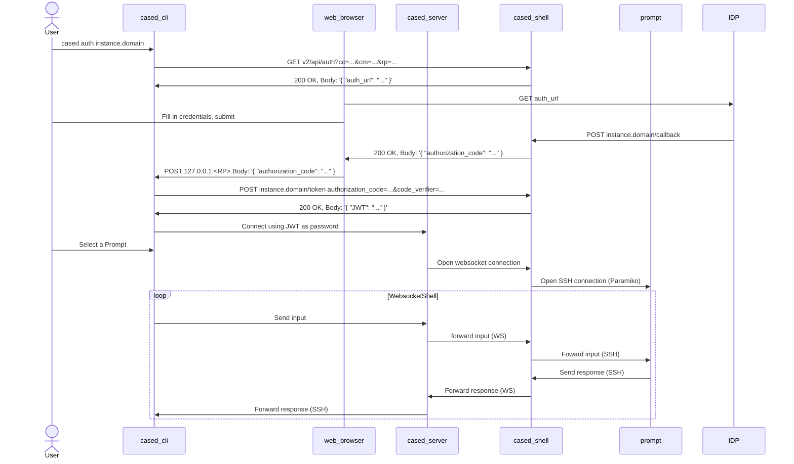

# Cased-CLI project architecture

This document describes the _cased-cli_ components along with the interaction between them.

## Components

- _cased-cli_: Command line tool installed on end user's machine, an ssh client, the actual command is just _cased_.
- _cased-server_: SSH server, handles _cased-cli_ connections and provide a TUI (terminal user interface) for the user to interact with.
- _cased-shell_: Software that provide resources to the cased-server over a REST API (Python/Tornado). Resources include the list of prompts a user can connect to along with managing connection to those prompts over a websocket channel.

### Notes on OAuth2 [PKCE](https://oauth.net/2/pkce/) terminology:

. `code_verifier`: A cryptographically random string using the characters A-Z, a-z, 0-9, and the punctuation characters -._~ (hyphen, period, underscore, and tilde), between 43 and 128 characters long. Once the client has generated the code verifier, it uses that to create the code challenge.
. `code_challenge`: A computation of `code_verifier` using `code_challenge_method`.
. `code_challenge_method`: Must be either `plain` or `s256`:
    . `plain`: The plain method does not change the input, so the value of `code_verifier` and the resultant value of `code_challenge` are equal.
    . `S256`: The `code_challenge` is the base64 encode of the sha256 hash of `code_verifier`, i.e. `code_challenge` = `base64encode(sha256(code_verifier))`.

### Establishing a ssh connection between _cased-cli_ and _cased-server_.

1. User types (in a shell): `cased auth instance.domain`.
2. `cased-cli` generates a random `code_verifier`, then calculates the `code_challenge` using `S256`.
3. `cased-cli` sends a GET request to `instance.domain/v2/api/auth/`, the `code_challenge` and `code_challenge_method` are sent as query parameters using `cc` and `cm` respectively, i.e. `v2/api/auth?cc=f718...&cm=S256`.
4. `cased-shell` sends back a JSON with the login url to authenticate the user.
5. `cased-cli` launches the user web browser, the web browser connects to the login URL provided by `cased-shell`.
6. User authenticates with the IDP.
7. If authentication is successful proceed to **7**, otherwise this process ends with an error message displayed to the user.
8. `cased-shell` generates a random `authorization_code`, then it stores the session `JWT`, `code_challenge` and `code_challenge_method` in a dictionary where the key is the `authorization_code`.
9. `cased-shell` sends back the `authorization_code` to cased-cli.
10. `cased-cli` obtains the `authorization_code`, then it sends a POST request to `cased-shell` on `/v2/api/token`, the `code_verifier` and `authorization_code` are sent as POST arguments (x-www-form-urlencoded).
    **NOTE**: One possible solution for allowing the web browser to send the `authorization_code` back to the `cased-cli` app could be implemented as follows:
        . In step _3_, `cased-cli` starts a temporary http server and listens on a random port (RP).
        . `cased-cli` sends a GET request to _cased-shell_ on the `instance.domain/v2/api/auth/` URL, the RP is sent as `rp` along with the `cc`and `cm` parameters.
        . After authenticating with the IDP, _cased-shell_ sends back [javascript code](#example-javascript-code) that creates a POST request to 127.0.0.1:(RP), and send the `authorization_code` as payload (JSON or whatever).
        . `cased-cli` parses the POST request and retrieves the `authorization_code`.
12. `cased-shell`, retrives the JWT, `code_challenge` and `code_challenge_method` associated with the `authorization_code`. If there is no associated data an error must be returned and the process ends.
13. `cased_shell` computes a code challenge using the the `code_verifier` provided and the `code_challenge_method` stored previously.
14. If the code challenge just computed matches the `code_challenge` stored initially, then the verification is ok, `cased-shell` sends back the session `JWT` to `cased-cli` in the response, otherwise return an error status + message.
15. `cased-cli` connects to `cased-server` using password authentication, where the password is the session `JWT` provided by `cased-shell`.
16. `cased-server` validates the JWT, if validation fails the user is disconnected from `cased-server`, otherwise the connection is succesfully established.

**TODO**: If `cased-cli` fails to open a web browser to authenticate the user, another fallback solution to authentication must be provided.

### Establishing a ssh connection to a target prompt.

1. User selects a prompt in the TUI provided by _cased-server_ then hits <ENTER>.
2. _cased-server_ sends a POST request to _cased-shell_ on the _/v2/_ along with the user session JWT
3. _cased_server_ sends a POST request to _cased-shell_ on the /v2/ws?id=<ID> with the <ID> fetched from _cased-shell_ in step 2.
4. If the websocket connection succeeds, _cased-server_ forwards terminal input from _cased-cli_ to _cased-server_ websocket connection, and data from the _cased-server_ websocket connection to the _cased-cli_ session, effectively acting as a bridge.

### Example javascript code
This is sample code that could be used to send the `authorization_code` back to the _cased-cli_.
NOTE: _{{.Port}}_ and _{{.AUTH}}_ are templates to be substituted by _cased-shell_.

```javascript
<script type="text/javascript">
    var xhr = new XMLHttpRequest();
    var url = "http://127.0.0.1:" + {{.Port}} + "/";
    xhr.open("POST", url, true);
    xhr.setRequestHeader("Content-Type", "application/json");
    xhr.onreadystatechange = function () {
        if (xhr.readyState === 4 && xhr.status === 200) {
            // success!
            // var json = JSON.parse(xhr.responseText);
            // Show some status message to the user using the element with id=result
            // document.getElementById("result").innerHTML = xhr.responseText;                    
        } else {
            // Error, maybe show authorization_code to the user and ask it to paste to the cased-cli?
        }
    };
    var data = JSON.stringify({"authorization_code": "{{.AUTH}}"});
    xhr.send(data);
</script>
```

### A visual presentation of the complete flow


